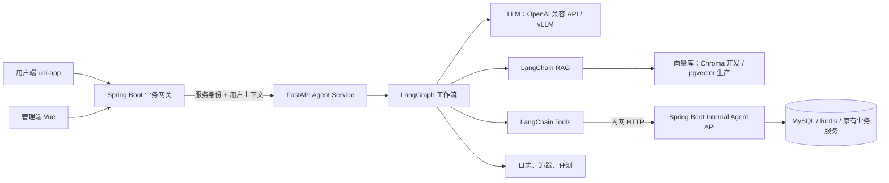

# 外卖平台 LangChain + RAG Agent 微服务开发计划

> 状态：规划，尚未实现。  
> 制定日期：2026-07-10。  
> 目标：以 Python `FastAPI + LangChain + LangGraph` 建设独立 Agent 服务；保留 Spring Boot 作为唯一业务规则与数据写入边界，渐进替换现有 Java 手写 Tool Calling 循环。

## 1. 现状与边界

当前项目已有管理端与用户端 AI 入口：

- 用户端：`/user/ai/chat`、`/user/ai/chat/stream`、`/user/ai/recommend`、`/user/ai/review/write`。
- 管理端：`/admin/ai/chat/stream`、`/admin/ai/health`。
- Java 后端目前通过 `AiToolCallingClient` 调 OpenAI 兼容模型，手写循环执行 Tool Calling；知识检索为本地文档关键词排序。

本计划不把 Python 服务直接连 MySQL 后写业务数据。订单、购物车、地址、优惠券、评价、敏感词和权限判断仍由 Spring Boot 负责，Python 只负责理解、检索、编排与调用受控内部 API。这样既复用现有业务规则，也避免 Agent 绕开权限、缓存和事务。

## 2. 目标架构



### 服务职责

| 组件 | 负责 | 不负责 |
| --- | --- | --- |
| Spring Boot | JWT 鉴权、用户/员工身份、业务校验、事务、数据库写入、对前端保持兼容的 AI 路由 | 推理编排、向量检索 |
| FastAPI Agent Service | 意图路由、RAG、提示词、工具选择、工作流状态、流式输出、Agent 评测 | 直接访问业务库、绕开确认执行写操作 |
| 向量库 | 文档 chunk 与 embedding 检索 | 保存订单等交易数据 |
| 模型服务 | 对话、工具选择、结构化输出 | 业务授权决策 |

### 调用安全约束

- Spring Boot 解析前端 JWT，向 Python 传递最小用户上下文：`request_id`、`actor_type`、`actor_id`、角色、租户（未来多门店时）、过期时间。
- 两个服务间使用独立的服务认证（短期 JWT 或 HMAC 签名），并限制为内网访问；Python 不接受客户端直接调用的内部工具请求。
- 所有写工具都采用两阶段语义：先返回 `confirmation_required` 和待执行摘要；只有用户再次明确确认后，才可携带确认令牌执行。
- Java 内部 API 再次验证身份、资源归属、参数和幂等键；模型输出、工具参数均不可信。
- 工具调用、确认、拒绝、异常与最终回答写入审计日志，敏感字段脱敏后再记录。

## 3. 范围与优先级

先完成高价值、低风险的用户侧闭环，再扩展管理端写操作。

| 优先级 | 场景 | 初期工具 | 验收结果 |
| --- | --- | --- | --- |
| P0 | 用户智能客服 | 店铺状态、菜单搜索、订单查询、地址查询、优惠券查询、购物车查询 | 能回答问题且不能越权读取他人数据 |
| P0 | 菜品推荐 | 菜单搜索、RAG（菜品/配送/优惠规则） | 返回可解释、可落地的菜品或套餐建议 |
| P1 | 购物车与领券 | 加购、删减、清空、领取优惠券 | 每次变更前都展示确认卡片并可幂等重试 |
| P1 | AI 辅助写评价 | 已完成订单校验、敏感词检查 | 只生成草稿，不替用户直接提交评价 |
| P1 | 管理端运营问答 | 营业状态、订单统计、菜品/套餐/优惠券查询、运营知识 RAG | 回答带数据时间范围与知识来源 |
| P2 | 管理端业务操作 | 菜品、分类、套餐、优惠券、敏感词等写工具 | 权限、确认、审计、回滚策略全部具备后再开放 |

## 4. 推荐目录与技术选型

在仓库根目录新增 `agent-service/`，保持独立 Python 依赖和部署单元：

```text
agent-service/
  app/
    api/                 # FastAPI 路由：chat、stream、health、ingest
    graphs/              # user_support.py、admin_ops.py
    tools/               # 对 Spring 内部 API 的强类型封装
    rag/                 # 加载、切分、向量化、检索、引用格式化
    clients/             # LLM、Spring Internal API、Redis、向量库
    schemas/             # Pydantic 请求/响应/工具参数模型
    prompts/             # 版本化系统提示词
    security/            # 服务签名、上下文验证、脱敏
    observability/       # request_id、结构化日志、trace、指标
  tests/
  evals/                 # 固定问题集、预期工具、预期拒绝行为
  scripts/               # 初始化/增量入库
  pyproject.toml
  Dockerfile
  .env.example
  AGENTS.md
```

建议依赖保持克制：`fastapi`、`uvicorn`、`langchain`、`langgraph`、对应模型 provider、`httpx`、`pydantic`、`structlog`、`pytest`。开发环境使用 Chroma；生产环境优先选 `pgvector`（便于备份、权限、持久化），若团队已有 Milvus/Elasticsearch 再按基础设施统一。模型和 embedding 模型均通过环境变量配置，禁止提交真实密钥。

## 5. 分阶段实施计划

### 阶段 0：冻结接口与建立基线（第 1 周）

1. 盘点当前 `/user/ai/**`、`/admin/ai/**` 请求与响应，导出为可版本控制的 OpenAPI/Apifox 契约。
2. 从现有 Tool Registry 提炼工具清单，标记为 `read`、`write`、`confirmation_required`、角色权限与幂等要求。
3. 定义统一协议：`ChatRequest`、`ChatEvent`（SSE）、`ToolConfirmation`、`SourceCitation`、`AgentError`。
4. 为现有 Java AI 入口增加可切换的 `agent.provider=legacy|python` 配置；默认仍走 `legacy`，确保随时可回退。
5. 建立基线测试问题集：正常问答、越权访问、提示词注入、未确认写操作、工具超时、模型不可用。

产出：接口契约、工具目录、风险清单、回退开关、至少 30 条评测样例。

### 阶段 1：Spring Boot 内部工具 API（第 1–2 周）

1. 新增仅供 Agent Service 调用的 `/internal/agent/**` 路由或独立 Controller，不直接复用面向前端的宽泛接口。
2. 先实现只读工具：店铺状态、菜单检索、订单摘要/详情、地址、购物车、可用优惠券、运营统计、敏感词检测。
3. 每个接口强制接收服务身份和 actor 上下文；服务端通过 actor id 查询数据，不信任 Python 提供的资源 id。
4. 定义稳定 JSON 响应：`ok`、`data`、`error_code`、`message`、`request_id`；避免把数据库实体直接暴露给模型。
5. 为每个内部 API 写 Spring MVC/Service 测试，覆盖越权、缺上下文、非法参数与幂等。

产出：内部 OpenAPI、Java 鉴权中间件、只读工具可独立验证。

### 阶段 2：FastAPI 服务骨架与兼容代理（第 2 周）

1. 创建 `agent-service`，实现 `/health`、`POST /v1/user/chat`、`GET /v1/user/chat/stream`、`POST /v1/admin/chat`。
2. 在 Java `AgentService` 适配器中调用 Python，并继续由原 Controller 向前端输出原有格式；先不改前端。
3. 使用 `httpx` 客户端封装超时、重试（只读请求）、熔断和错误映射；写操作严禁自动重试。
4. 贯穿 `request_id`，实现结构化日志与基础指标：请求量、耗时、模型耗时、工具耗时、错误率。
5. Docker Compose 同时启动 Java、Python、Chroma、Redis（仅本地开发），提供 `.env.example`。

产出：不含 RAG 的端到端 hello-agent，前端可通过开关走新服务。

### 阶段 3：RAG 知识库（第 3 周）

1. 明确知识源白名单：营业/配送/退款规则、优惠券规则、菜品与套餐说明、客服 SOP、运营手册；不把用户订单、地址、手机号写入向量库。
2. 建立 Markdown/PDF/HTML 加载器，按标题语义切分；每段保存 `source`、`title`、`updated_at`、`domain`、`visibility`、`content_hash`。
3. 编写全量与增量 ingestion 命令；hash 未变化的文件不重复嵌入，删除源文件时删除对应向量。
4. 检索采用“元数据过滤 + 向量 Top-K + 可选重排”；用户 Agent 只能读取公开/用户可见知识，管理端按角色过滤。
5. 最终答案引用来源标题和更新时间；检索低置信度时明确说“不确定”，不编造规则。

产出：可重复构建的知识库、来源引用、检索评测集（至少 20 个命中与 10 个拒答样例）。

### 阶段 4：用户侧 LangGraph 工作流（第 4 周）

```text
START
  -> 认证上下文校验
  -> 意图分类
  -> RAG 检索（仅需要时）
  -> 工具选择与参数校验
  -> 执行只读工具 / 生成确认请求
  -> 安全与敏感内容检查
  -> 流式回答（含来源、建议操作）
  -> END
```

1. 以 Pydantic schema 约束图状态和每个工具参数；不要让工具接收任意 JSON。
2. 将 `menu_search`、`get_order`、`get_cart`、`list_coupons` 等实现为独立 LangChain Tools。
3. 写操作进入 `awaiting_confirmation` 状态；确认 token 与会话、用户、操作摘要、过期时间绑定。
4. 会话短期状态存在 Redis，长期审计存 Java 侧表或专用审计库；不要只靠进程内内存。
5. 支持模型或工具异常降级：优先回退为规则化说明，必要时引导人工客服。

产出：用户客服、推荐、评价草稿三条完整链路及 SSE 真流式输出。

### 阶段 5：管理端 LangGraph 工作流（第 5 周）

1. 将管理端问答与写操作分为两张图，默认只开放只读运营助手。
2. 在图中加入角色策略节点、日期范围澄清节点、数据口径提示节点和确认节点。
3. 管理端回答展示数据来源、查询范围与生成时间；涉及经营结论时注明“辅助分析，不替代人工决策”。
4. 写工具按风险分级：低风险可二次确认，高风险（删改、状态变更）要求前端确认卡片与审计理由。

产出：管理端运营问答稳定可用；写操作仅在逐工具验收后灰度开启。

### 阶段 6：质量、安全与上线（第 6 周）

1. 建立三层测试：纯函数/工具单测、Mock Spring API 集成测试、真实环境端到端冒烟测试。
2. 建立 Agent eval：工具选择准确率、RAG 命中率、引用正确率、越权拦截率、确认漏执行率、平均耗时与成本。
3. 加入限流、会话配额、超时、熔断、脱敏、提示词注入防护、审计保留策略。
4. 使用 feature flag 按用户/管理员灰度，保留 `legacy` 路径；出现错误率或越权告警时一键切回。
5. 提供部署文档、健康检查、告警阈值、数据备份与向量重建手册。

产出：可观测、可回滚、可发布的 Agent 微服务版本。

## 6. 关键接口草案

### Java 调用 Python

`POST /v1/user/chat`

```json
{
  "request_id": "uuid",
  "actor": {"type": "user", "id": 1001},
  "session_id": "optional-session-id",
  "message": "帮我找一份不辣的午餐",
  "confirmed_action_token": null
}
```

响应包含 `answer`、`session_id`、`citations`、`suggested_actions`、`confirmation`、`trace_id`。流式接口使用 SSE，至少定义 `delta`、`tool_status`、`citation`、`done`、`error` 事件。

### Python 调用 Java

建议首批内部接口：

```text
GET  /internal/agent/shop/status
GET  /internal/agent/menu/search
GET  /internal/agent/orders/{orderId}
GET  /internal/agent/orders/recent
GET  /internal/agent/cart
GET  /internal/agent/addresses
GET  /internal/agent/coupons/available
POST /internal/agent/cart/changes              # 仅确认后
POST /internal/agent/coupons/{id}/claim        # 仅确认后
POST /internal/agent/reviews/draft/check
POST /internal/agent/sensitive-words/check
```

接口名是设计草案，落地前应与现有 Controller/Service 逐项校准，并把正式版本写入 OpenAPI。

## 7. 使用 Codex 高效开发的工作计划

### 7.1 先准备“可喂给 Codex 的项目资料包”

不要只给一句“帮我做 Agent”。在每次实现前，把以下文档放进仓库并在提示词中明确路径：

```text
docs/agent-service/
  00-product-scope.md          # 用户故事、非目标、验收标准
  01-architecture.md           # 本文架构的最终确认版
  02-internal-api.openapi.yaml # Java ↔ Python 契约
  03-tool-catalog.md           # 名称、输入、权限、确认、幂等、示例
  04-rag-knowledge-sources.md  # 来源白名单、可见范围、更新规则
  05-prompt-policy.md          # 系统提示词、拒绝策略、回答口径
  06-test-cases.md             # 正常、越权、注入、异常用例
  07-decisions.md              # ADR：为何 Python、为何不直连 DB 等
```

`agent-service/AGENTS.md` 只写强约束：Python 版本、启动/测试命令、目录职责、禁止直连业务 DB、不得提交密钥、所有写工具必须确认、修改契约必须同步测试。这样每个 Codex 任务都有稳定上下文，避免不同任务写出互相矛盾的实现。

### 7.2 多 Agent 的分工与节奏

先由一个“架构/集成”任务确定接口契约，再并行开发互不重叠的目录。每个 Codex task 使用独立 Git worktree/分支，建议命名为 `codex/<scope>`；不要让两个 Agent 同时修改同一个 OpenAPI、同一份 prompt 或同一个 Controller。

| 任务 | 负责目录 | 前置条件 | 交付 |
| --- | --- | --- | --- |
| 架构 Agent | `docs/agent-service/` | 现有代码盘点 | 契约、工具目录、ADR |
| Java Agent | `backend/` | 契约冻结 | Internal API、服务认证、适配器 |
| Python Agent | `agent-service/app/` | 契约冻结 | FastAPI、LangGraph、Tools、RAG |
| 测试 Agent | `agent-service/tests/`、`evals/` | 接口可调用 | Mock 集成测试、评测报告 |
| 运维 Agent | Compose、Docker、CI 文档 | 服务骨架完成 | 本地一键启动、健康检查、告警 |
| 集成/审查 Agent | 跨模块少量改动 | 前述任务完成 | 合并、回归、风险清单 |

推荐顺序：架构 Agent 完成并提交 → Java/Python/RAG 并行 → 测试 Agent 补齐契约测试 → 集成 Agent 只处理冲突与端到端问题。每个任务结束前都要求 Codex 输出“修改文件、运行命令、测试结果、未解决风险”，再进入下一个任务。

### 7.3 给 Codex 的高质量任务提示词

每次只交付一个可验收切片，并提供边界、文件、契约和测试命令。示例：

```text
你在 F:\\sky-takeout-agent 工作。先阅读：
- docs/LANGCHAIN_RAG_AGENT_MICROSERVICE_PLAN.md
- docs/agent-service/02-internal-api.openapi.yaml
- docs/agent-service/03-tool-catalog.md

任务：在 agent-service 中实现只读 menu_search LangChain Tool。
约束：不得直接访问 MySQL；仅调用 GET /internal/agent/menu/search；
必须透传 request_id 和 actor 上下文；Pydantic 严格校验参数；
超时 3 秒；失败返回可供 Agent 解释的结构化错误。
测试：为正常结果、无结果、401、超时分别写 pytest；执行指定测试。
不要修改 backend 或前端；结束时汇报修改、测试输出和遗留风险。
```

对跨服务工作使用两段式提示：第一段只让 Codex 输出设计/变更清单，确认契约后第二段再实现。对于危险写工具，应要求 Codex 先补测试与确认状态机，再接入真实业务调用。

### 7.4 每日协作循环

1. 先在 `00-product-scope.md` 选一个用户故事，写清验收标准。
2. 创建一个 Codex task，限定一个模块和不允许修改的目录。
3. 让 Codex 先阅读相关文档、汇报实现计划；计划无误后再请求改代码。
4. 每个切片完成后运行最小测试，再运行相关集成测试；把结果补进 `06-test-cases.md` 或评测报告。
5. 人工审查写操作、权限和数据暴露；确认后提交。最后由集成 task 做完整启动与回归。

## 8. Definition of Done

一个 Agent 能力只有同时满足以下条件才算完成：

- 前后端或兼容路由可真实调用，且失败时有用户可理解的降级；
- Tool 有输入 schema、权限、超时、错误映射和审计；写操作有确认和幂等；
- RAG 答案可显示来源，且知识权限不过界；
- 正常、越权、提示词注入、超时和模型不可用测试通过；
- 文档、OpenAPI、工具目录、环境变量示例同步更新；
- 通过 feature flag 可灰度和回退至现有 Java `legacy` Agent。

## 9. 首个可执行里程碑

不要一开始做“全能 Agent”。第一个 PR 建议只包含：`agent-service` FastAPI 骨架、健康检查、服务认证、`menu_search` 只读 Tool、Chroma 本地知识库、用户侧“菜品推荐/营业规则问答”图、Java 兼容代理开关、10 条 pytest 和 10 条 RAG eval。这个范围足以形成可演示闭环，也为后续订单、购物车和管理端能力提供稳定底座。
