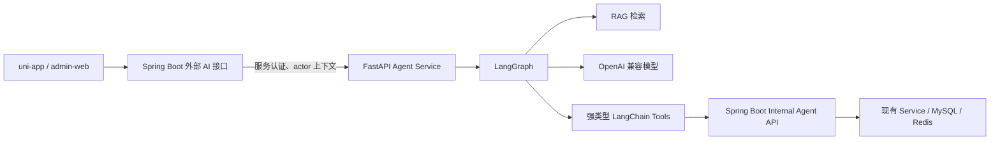

# Agent 服务架构说明

## 架构决策

采用 `Spring Boot + FastAPI Agent Service` 的双服务架构：Java 继续承担身份、权限、事务和业务写入；Python 承担 LangChain 工具、LangGraph 编排、RAG 和模型调用。

## 组件责任

| 组件 | 必须负责 | 禁止负责 |
| --- | --- | --- |
| Spring Boot 外部接口 | 前端 JWT、兼容已有响应、路由切换、SSE 转发 | 将模型参数作为业务授权依据 |
| Internal Agent API | 服务认证、actor 校验、资源归属、事务、幂等、审计 | 将数据库实体或内部异常直接暴露给模型 |
| Agent Service | 意图路由、LangGraph 状态、RAG、工具选择、输出格式化 | 直连业务数据库、伪造 actor、执行未确认写操作 |
| 向量库 | 已批准文档的向量检索和元数据过滤 | 保存订单、地址、手机号、支付信息 |
| 模型服务 | 生成回答、结构化工具参数 | 决定权限、代替业务校验 |

## 迁移策略

1. 现有 `AiToolCallingClient`、Registry 和 Executor 保持可用，作为 `legacy` 回退路径。
2. Java 增加 `agent.provider=legacy|python`，默认 `legacy`。
3. Python 首先只接管菜单推荐和规则问答等只读场景。
4. 内部 API 和 Python Tool 契约稳定后，再分批迁移订单、购物车、优惠券等能力。
5. 每批灰度都记录错误率、越权告警、工具超时和用户反馈，可一键切回 `legacy`。

## 安全数据流

- 前端 token 只在 Spring Boot 校验；Python 接收短期、最小化的 actor 上下文。
- Java 到 Python、Python 到 Java 的两段调用都必须使用独立服务认证，且仅内网可达。
- actor 至少包含 `actor_type`、`actor_id`、`roles`、`request_id`、`expires_at`；未来支持门店时再加入 `tenant_id`。
- 任何资源标识都必须由 Java 依据 actor 重新校验，不能仅依据 Python 传来的订单 id 或用户 id。
- 所有写工具采用“生成确认请求 → 前端展示 → 用户确认 → Java 最终校验与执行”的两阶段协议。

## 运行与回退

- Agent Service 无状态部署；会话短状态保存在 Redis，审计记录保存在 Java 侧或独立审计库。
- Agent Service 不可用时，Java 返回友好降级信息或调用 `legacy`，不得无限重试。
- 向量库故障时，只关闭 RAG 分支；实时业务查询工具仍可工作。
- 模型、embedding、向量库、Java 内部地址均通过环境变量配置，密钥只存在本地 `.env` 或密钥管理服务。
