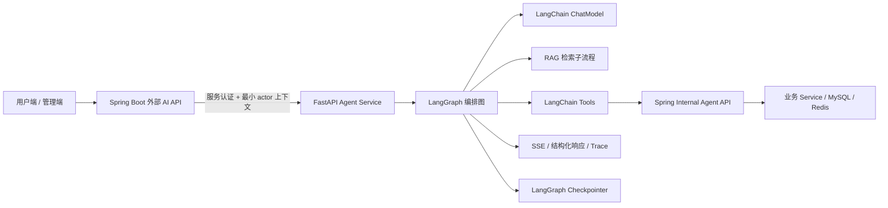
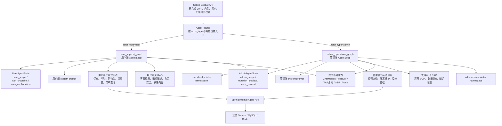
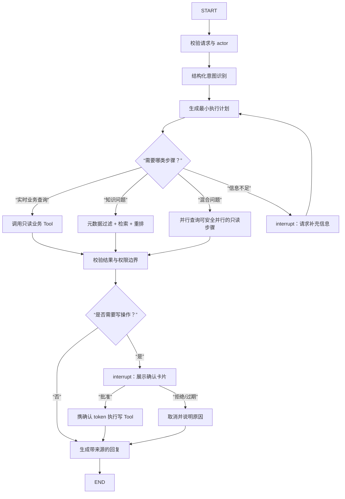
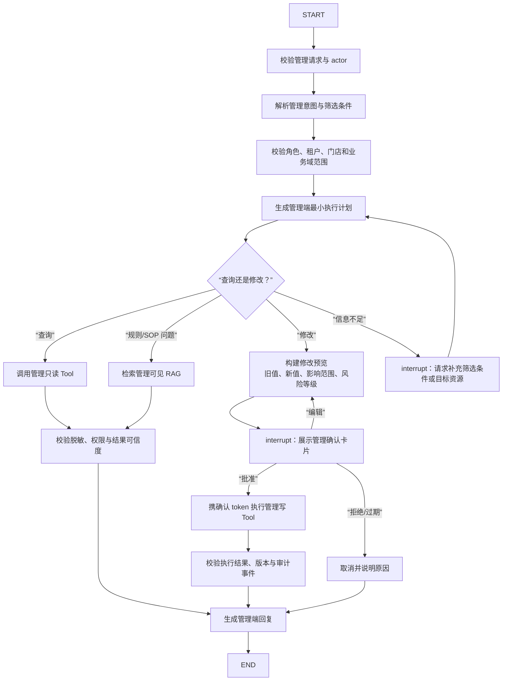
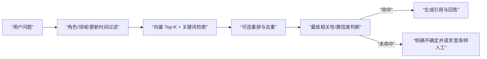

# LangChain + LangGraph Agent Service 完整规划与编排方案

> 状态：实施中的目标方案
> 更新：2026-07-20
> 适用目录：`agent-service/`
> 官方设计依据：[Thinking in LangGraph](https://docs.langchain.com/oss/python/langgraph/thinking-in-langgraph)、[Graph API](https://docs.langchain.com/oss/python/langgraph/graph-api)、[Persistence](https://docs.langchain.com/oss/python/langgraph/persistence)、[Interrupts](https://docs.langchain.com/oss/python/langgraph/interrupts)、[Fault tolerance](https://docs.langchain.com/oss/python/langgraph/fault-tolerance)

## 1. 目标与边界

本服务是外卖系统的 Agent 编排层，负责理解请求、规划步骤、检索知识、选择工具、生成回复和输出执行进度。Spring Boot 仍是唯一的业务权威边界，负责身份、权限、业务校验、事务和数据写入。

### 目标

- 使用 Python、FastAPI、LangChain 1.x 与 LangGraph 1.x 构建可恢复、可观测、可测试的 Agent。
- 将复杂请求拆解为可追踪的图节点，而不是把全部逻辑塞进一个“万能 Agent”循环。
- 统一支持同步响应、SSE 流式事件、工具调用、RAG、人工确认和降级回复。
- 让每次工具调用都携带最小 actor 上下文、`request_id` 和可审计的执行结果。

### 非目标

- 不直接连接 MySQL、Redis、ORM 或外卖业务 Service。
- 不让模型决定权限、价格、库存、退款资格或数据归属。
- 不把 JWT、完整手机号、地址、密钥、完整提示词或未脱敏业务数据写入日志。
- 不把 RAG 当作实时订单、购物车、优惠券状态的事实来源。

## 2. 现状基线

当前 `agent-service/pyproject.toml` 已约束：Python >= 3.11、`langchain>=1.3.13,<2`、`langchain-core>=1.4.9,<2`、`langchain-openai>=1.3.5,<2`、`langgraph>=1.2.9,<2`。依赖升级必须通过 `pyproject.toml` 统一变更，并在升级后运行完整测试和评测集。

已有代码分层：

```text
app/api/             FastAPI 入口、同步与 SSE
app/graphs/          LangGraph 工作流
app/tools/           LangChain Tool 封装
app/clients/         Spring Internal API、模型和向量库客户端
app/schemas/         Pydantic 请求、状态、工具和响应模型
app/rag/             知识加载、索引、检索
app/prompts/         版本化提示词
app/security/        actor 与服务认证
tests/               单元和接口测试
evals/               固定评测样例
```

## 3. 总体架构



### 3.1 Agent / Graph 拓扑

本项目采用两个主 Agent、两个主 LangGraph 图。它们共享基础运行时能力，但不共享状态、工具注册表、prompt、RAG 可见性过滤和 checkpoint 命名空间。



Pattern 上使用显式 `Agent Loop` 作为外层控制流：每个图负责状态推进、条件路由、工具调用、确认暂停和恢复。图内有一个受限 `make_plan` 节点生成最小执行计划；工具选择和结果校验允许局部采用 ReAct 风格的“观察后再决策”，但必须受步骤上限、能力白名单和确认规则约束。

职责分界：

| 组件 | 负责 | 不负责 |
| --- | --- | --- |
| Spring Boot 外部 API | JWT、兼容旧接口、SSE 转发、限流 | 模型推理与 Agent 路由 |
| 用户 Agent | 面向消费者的点餐、订单、购物车、优惠券和售后问答 | 管理数据、跨用户查询、未确认写入 |
| 管理 Agent | 面向运营人员的经营查询、数据分析和受控业务维护 | 用户私有数据越权、未确认修改、直接数据库写入 |
| Agent Service | 两个 Agent 的入口、状态、图路由、RAG、工具编排和回复 | 业务权限和数据库写入 |
| LangChain | ChatModel、消息、结构化输出、Tool、Retriever | 业务事务 |
| LangGraph | 状态、节点、条件路由、重试、暂停、恢复、持久化 | 替代业务 API |
| Spring Internal API | actor 二次校验、资源归属、业务规则、幂等写入、审计 | 让模型直接访问实体 |

## 4. LangGraph 的设计原则

按照官方“Thinking in LangGraph”的顺序设计每个场景：

1. 先写出要自动化的业务流程。
2. 将流程拆成离散的 LLM、数据、动作和用户输入步骤。
3. 设计共享状态，只保存后续节点需要且不能低成本重建的原始数据。
4. 每个节点只做一件事，返回状态更新；需要路由时返回带 `goto` 的 `Command`。
5. 为不同错误选择不同策略：瞬时错误重试、模型可修复错误回环、用户可修复错误 `interrupt()`、重试耗尽走补偿分支、未知错误上抛。
6. 通过 checkpointer 和 `thread_id` 支持暂停后恢复、审计和故障排查。

LangChain 负责“模型和工具能力”，LangGraph 负责“有状态的控制流”。简单对话可使用 LangChain 的高层 Agent；涉及本项目的权限、确认、降级、审计和多阶段流程时，必须由显式 LangGraph 图掌握外层编排。

## 5. 统一状态模型

状态使用 `TypedDict` 或 Pydantic 明确声明，禁止跨模块使用裸 `dict[str, Any]`。状态保存原始结构化数据，提示词在节点内部按需格式化。

```python
class BaseAgentState(TypedDict, total=False):
    request_id: str
    session_id: str
    actor: ActorContext
    user_message: str
    messages: list[BaseMessage]
    intent: IntentResult
    plan: AgentPlan
    plan_step: int
    retrieved_context: list[KnowledgeChunk]
    citations: list[SourceCitation]
    tool_call: ToolCallRequest
    tool_result: ToolResult
    pending_confirmation: ConfirmationRequest
    answer: str
    response_status: Literal["running", "waiting_user", "completed", "degraded", "failed"]
    error: AgentError | None
    trace: ExecutionTrace
```

### 状态规则

- 保留 `user_message`、actor 摘要、结构化意图、计划、检索结果、工具结果、确认请求和最终答案。
- 不保存可由其他字段推导的格式化 prompt、重复全文或模型内部思维链；仅记录可审计的计划摘要和节点结果。
- 所有状态字段必须可序列化为 JSON，避免把连接、函数、异常对象或 ORM 实体放入 checkpoint。
- `messages` 只保存对话所需消息，并按敏感字段脱敏和长度裁剪。
- 每个节点更新最小字段，避免并发节点互相覆盖无关状态。

### 5.1 两套状态类型

共享基础状态只包含 request、session、actor 摘要、消息、计划、检索结果、工具结果、确认状态和 trace；业务范围字段必须按 Agent 隔离：

```python
class UserAgentState(BaseAgentState, total=False):
    user_scope: UserResourceScope
    cart_snapshot: CartSnapshot
    user_confirmation: ConfirmationRequest

class AdminAgentState(BaseAgentState, total=False):
    admin_scope: AdminResourceScope
    query_filters: AdminQueryFilters
    mutation_preview: AdminMutationPreview
    admin_confirmation: ConfirmationRequest
    audit_context: AuditContext
```

`AdminAgentState` 不能由用户请求构造，`UserAgentState` 不能携带管理角色、管理查询过滤器或管理资源范围。两个状态必须使用不同的 graph builder 和 checkpointer namespace；恢复时校验 `agent_name + thread_id + actor` 三者一致。

## 6. 用户 Agent 基础编排图

### 6.1 主流程



### 6.2 节点职责

| 节点 | 类型 | 输入 | 输出/路由 |
| --- | --- | --- | --- |
| `validate_context` | 数据/安全 | 请求、actor | 规范化上下文；非法请求结束 |
| `classify_intent` | LLM | 用户消息、静态策略 | Pydantic 意图；低置信度转澄清 |
| `make_plan` | LLM/规则 | 意图、角色、能力目录 | 有限步骤 `AgentPlan` |
| `retrieve_knowledge` | 数据 | 查询、可见性、领域 | chunks、引用；无命中进入不确定分支 |
| `call_read_tool` | 动作 | 严格 Tool 参数 | 业务事实或结构化工具错误 |
| `check_result` | 规则 | 工具/RAG 结果 | 继续、重试、回环或降级 |
| `request_confirmation` | 用户输入 | 写操作摘要 | `interrupt()` 暂停 |
| `execute_write_tool` | 动作 | 确认 token、幂等键 | 写入结果；拒绝不重试 |
| `compose_answer` | LLM | 事实、引用、执行结果 | 最终答案和建议动作 |
| `fallback` | 规则/模板 | 错误与上下文 | 可理解的降级结果 |

### 6.3 计划约束

计划不是模型自由生成的代码，而是受限数据结构：

```python
class PlanStep(BaseModel):
    id: str
    kind: Literal["retrieve", "read_tool", "write_tool", "clarify", "respond"]
    capability: str
    depends_on: list[str] = []
    requires_confirmation: bool = False

class AgentPlan(BaseModel):
    goal: str
    steps: list[PlanStep]
    max_steps: int = 6
```

服务端必须再次校验：能力是否在注册表、步骤数量是否超限、是否存在循环、角色是否允许、写操作是否强制确认。模型不能直接提供 URL、SQL、内部路径、actor_id 或确认 token。

## 7. 双 Agent 隔离与管理端编排

用户 Agent 和管理 Agent 必须是两个独立 Agent，而不是一个通用 prompt 加一张无限制工具表。两者可以共享模型客户端、LangGraph 运行时、checkpointer、观测和基础 Tool 合同，但必须分别拥有独立的 system prompt、状态类型、计划 schema、工具注册表、RAG 可见性过滤、路由入口和评测集。

入口根据 Spring Boot 已校验的 `actor_type` 和角色选择 Agent，Python 再次校验：`user` 只能进入用户图，`admin` 只能进入管理图。模型输出的 `agent_name`、角色、资源 ID、门店 ID 和租户 ID 一律不能作为授权依据。

| 对比项 | 用户 Agent | 管理 Agent |
| --- | --- | --- |
| 服务对象 | 普通用户 | 管理员/运营人员 |
| 目标 | 点餐、查订单、购物车、优惠券、售后问答 | 经营查询、数据分析和受控业务维护 |
| 数据范围 | 当前用户自己的资源和公开知识 | 角色授权的门店、租户、时间范围和业务域 |
| 查询能力 | 当前用户订单、地址、购物车、优惠券、菜单 | 订单、菜品、套餐、门店、优惠券、评价和运营统计 |
| 修改能力 | 加购、修改/删除购物车、领券 | 订单、菜品、套餐、优惠券、门店配置、敏感词等 |
| 修改确认 | 每次变更前用户确认 | 每次变更前管理员确认；高风险操作可二次审批 |
| RAG 范围 | 用户可见客服、退款、配送、食品安全和敏感内容规则 | 管理 SOP、运营规则、审批矩阵和知识治理 |

### 7.1 用户 Agent 工具与确认

用户 Agent 首批工具分组如下：

| 工具 | 类型 | 说明 | 确认 |
| --- | --- | --- | --- |
| `shop_status`、`menu_search` | read | 查询营业状态和菜单 | 否 |
| `get_order`、`recent_orders` | read | 查询当前用户订单 | 否 |
| `get_addresses`、`get_cart`、`list_coupons` | read | 查询当前用户资源 | 否 |
| `add_to_cart` | write | 添加菜品/套餐及数量 | 必须 |
| `update_cart_item` | write | 修改数量、规格或备注 | 必须 |
| `remove_from_cart`、`clear_cart` | write | 删除购物车项或清空购物车 | 必须 |
| `claim_coupon` | write | 领取优惠券 | 必须 |
| `check_review_draft` | draft | 检查评价草稿，不直接提交 | 否 |

用户图固定为：

```text
validate_user_context
  -> classify_user_intent
  -> make_user_plan
  -> retrieve_user_knowledge / call_user_read_tool
  -> check_user_result
  -> [需要变更] build_user_mutation_preview
  -> interrupt(request_user_confirmation)
  -> [批准] execute_user_write_tool
  -> compose_user_answer
```

加购、修改/删除购物车和领券必须先返回确认卡片，包含商品、数量、价格快照、优惠、影响范围、过期时间和一次性 `confirmation_token`。用户明确批准后才恢复图并调用 Java；拒绝、过期、参数变化或 actor 变化都必须重新规划，不能复用旧 token。

### 7.2 管理 Agent 查询与修改

管理 Agent 可查询和维护经过授权的业务数据，但“权限更宽”不等于“模型可直接修改”。查询可以自动执行；任何修改、删除、上下架、状态变更或批量操作都必须经过确认，并由 Java 端重新校验角色、门店/租户范围、字段白名单、乐观锁版本和幂等键。

管理图固定为：



管理端工具分组：

| 类别 | 工具示例 | 默认确认 |
| --- | --- | --- |
| 经营查询 | `admin_order_search`、`admin_order_detail`、`admin_sales_statistics`、`admin_shop_status` | 否 |
| 商品查询 | `admin_menu_search`、`admin_set_meal_search`、`admin_coupon_search` | 否 |
| 用户服务查询 | `admin_review_search`、`admin_customer_service_history` | 否，必须脱敏 |
| 商品/套餐修改 | `admin_update_menu_item`、`admin_update_set_meal`、`admin_update_price`、`admin_toggle_menu_item` | 必须 |
| 优惠与门店修改 | `admin_update_coupon`、`admin_update_shop_status`、`admin_update_delivery_rule` | 必须 |
| 订单受控操作 | `admin_update_order_status`、`admin_assign_order` | 必须；高风险可二次审批 |
| 运营配置 | `admin_update_sensitive_words`、`admin_update_operation_rule` | 必须，需审计 |
| 批量操作 | `admin_batch_update_*` | 必须；默认关闭，需额外审批 |

管理端修改工具不得提供任意字段更新。每个工具必须定义字段白名单、旧值/新值、影响数量、版本号、最大批量、回滚方式和审计事件。物理删除默认不纳入 Agent 能力，优先使用停用或软删除。

管理确认卡片必须展示操作者、门店/租户、目标资源、筛选条件、旧值、新值、影响条数、风险等级、版本号、过期时间和审计说明。管理员可以批准、编辑或拒绝；编辑后必须重新生成预览并校验。任何参数变化、权限变化、版本冲突或 token 过期都回到 `build_mutation_preview`，禁止直接重放。

### 7.3 双 Agent 计划白名单

用户 Agent 只允许：`retrieve_user_data`、`search_menu`、`search_user_knowledge`、`propose_cart_change`、`propose_coupon_claim`、`confirm_user_action`、`compose_user_reply`。

管理 Agent 只允许：`query_admin_data`、`aggregate_admin_metrics`、`search_admin_knowledge`、`preview_admin_mutation`、`confirm_admin_mutation`、`verify_admin_result`、`compose_admin_answer`。

两个 Agent 禁止互相调用对方的图、prompt、RAG 索引和工具注册表。模型不能生成任意 HTTP 方法、URL、SQL、字段名或批量脚本。

## 8. 工具编排规范

### 7.1 工具分级

| 级别 | 示例 | 策略 |
| --- | --- | --- |
| `read` | 店铺状态、菜单、订单、地址、购物车、优惠券查询 | 可自动执行；只读超时最多重试一次 |
| `draft` | 评价草稿、客服回复草稿 | 可自动执行；不改变业务数据 |
| `write` | 加购、领券、修改购物车 | 必须 `interrupt()` 并携确认 token |
| `high_risk_write` | 删除、退款、状态变更 | 前端确认 + Java 权限/业务校验 + 审计；默认关闭 |

### 7.2 Tool 合同

每个 Tool 必须具备：Pydantic 输入模型、明确返回模型、超时、错误码映射、权限标签、幂等策略、审计字段和测试用例。Tool 只调用 `app/clients/spring_internal.py`，不得越过客户端访问业务系统。

写操作的固定流程：

```text
模型提出动作
  -> 服务端校验工具名、参数、actor 和资源归属
  -> 生成一次性 confirmation_id / token
  -> interrupt() 返回摘要、影响范围、过期时间
  -> 用户批准
  -> Java 再次鉴权和校验
  -> 使用幂等键执行一次
  -> 记录审计并返回结果
```

不得自动重试写请求。Java 返回“已执行/未知结果”时，Agent 应查询最终状态或降级说明，不能盲目再次写入。

## 9. RAG 编排

RAG 只服务于经审核的客服规则、敏感内容、SOP、退款解释、优惠使用说明、食品安全和运营手册。菜品主数据、价格、规格、库存、订单、地址、手机号、支付、优惠实时资格和退款金额必须通过业务 Tool 获取。

### 9.1 真实业务语料不是只有 Markdown

生产语料采用混合来源，但统一转换为带来源和权限元数据的 chunk：

| 来源形式 | 适合内容 | 入库方式 |
| --- | --- | --- |
| Markdown/HTML | FAQ、规则、SOP、产品说明 | 按标题和段落切分 |
| PDF | 制度、退款矩阵、运营手册、带表格的审批规则 | 抽取段落和表格，保留页码/表名 |
| XLSX/CSV | 菜单、规格、优惠、权限矩阵、字段字典 | 按工作表/表头/行切分，保留列名 |
| JSON | API 响应样例、事件 schema、Tool 合同 | 作为结构化样例或 schema，不作为实时事实 |
| Spring Internal API | 订单状态、库存、优惠资格、退款金额、权限结果 | 不进入 RAG，运行时调用 |

当前 loader 支持带 front matter 的 Markdown，以及由 `structured-sources.json` 审核通过的 PDF、XLSX、CSV、JSON，并转为统一 `KnowledgeChunk`。任何格式都必须经过 `status=approved`、`visibility`、actor/角色、门店/租户和更新时间过滤，不能因为文件是表格或 PDF 就绕过权限控制。



文档元数据至少包含 `source`、`title`、`updated_at`、`domain`、`visibility`、`content_hash`。回答必须引用来源标题和更新时间；不能因为检索不到就编造规则。索引构建采用 hash 增量更新、可重复执行和版本化回滚。

## 10. 错误、重试与降级

| 错误 | 处理 | 是否回到模型 |
| --- | --- | --- |
| 网络抖动、限流、临时 5xx | 节点 `RetryPolicy`，限制次数和总超时 | 否 |
| Tool 参数或解析错误 | 将结构化错误写入状态，回到计划/工具选择节点 | 是，最多一次 |
| 缺少订单号、地址等信息 | `interrupt()` 请求用户补充 | 否，等待恢复 |
| 权限不足、资源不归属 | 立即拒绝，记录安全事件 | 否 |
| 写操作超时且结果未知 | 查询最终状态或人工处理 | 否 |
| RAG 无命中/向量库不可用 | 关闭 RAG 分支，使用实时 Tool 或模板降级 | 可选 |
| 重试耗尽的已知失败 | `error_handler` 更新错误并路由 `fallback` | 否 |
| 未知编程错误 | 上抛，告警，保留 trace | 否 |

`interrupt()` 不得包在 `try/except` 中；interrupt 前的副作用必须幂等；恢复时节点会从头执行，因此确认前不得执行真实写操作。生产环境使用持久化 checkpointer，开发测试可使用内存实现。

## 11. 持久化、恢复与流式输出

- `thread_id` 绑定会话，`request_id` 绑定一次请求；两者不能混用。
- checkpointer 保存可恢复的图状态，不保存密钥和未经脱敏的敏感信息。
- 生产使用可持久化后端；开发测试使用 `InMemorySaver`/内存 checkpointer。
- SSE 至少输出 `run_started`、`node_started`、`tool_started`、`tool_finished`、`citation`、`interrupt`、`delta`、`done`、`error`。
- 基于 LangGraph v2 流式结果统一处理 `updates`、`messages` 和 interrupt；客户端断线后可按 `thread_id` 恢复，不重复执行已确认的写操作。

## 12. API 规划

### Agent Service 对外（仅供 Spring 调用）

```text
GET  /health
POST /v1/user/chat
POST /v1/user/chat/stream
POST /v1/admin/chat
POST /v1/admin/chat/stream
POST /v1/threads/{thread_id}/resume
```

路由与 Agent 必须一一对应：`/v1/user/*` 只能调用 `user_support_agent`，`/v1/admin/*` 只能调用 `admin_operations_agent`。resume 请求必须携带原 `thread_id`、`agent_name` 和 actor 摘要，服务端校验三者一致后才能恢复；不能用用户线程恢复管理图，也不能用管理线程恢复用户图。

请求至少包含 `request_id`、`session_id`、最小 actor、消息和可选的 resume/confirmation 数据。响应包含 `answer`、`status`、`citations`、`suggested_actions`、`confirmation`、`trace_id` 和结构化错误。

### Python 调用 Spring Internal API

首批只读接口：

```text
GET  /internal/agent/shop/status
GET  /internal/agent/menu/search
GET  /internal/agent/orders/{order_id}
GET  /internal/agent/orders/recent
GET  /internal/agent/cart
GET  /internal/agent/addresses
GET  /internal/agent/coupons/available
POST /internal/agent/reviews/draft/check
POST /internal/agent/sensitive-words/check
```

写接口后续按工具逐个开放，必须先更新 `02-internal-api-contract.md`、`03-tool-catalog.md` 和测试。

## 13. 实施阶段与交付物

### P0：合同与骨架

- 固化 ChatRequest、ChatEvent、ActorContext、ToolResult、Citation、AgentError。
- 完成服务认证、健康检查、request/session/trace 贯穿。
- 补齐工具注册表和只读工具合同。

### P1：用户 Agent 只读闭环

- `validate_user_context -> classify_user_intent -> make_user_plan -> read_tool/RAG -> check_user_result -> compose_user_answer`。
- 完成客服规则、退款解释、配送 FAQ、敏感内容处理和升级矩阵 RAG；菜单、订单、地址、购物车和优惠券只通过实时 Tool 查询。
- 支持同步和 SSE，RAG 回答包含来源。

### P2：用户 Agent 确认与个人写工具

- 为缺失信息、加购、修改/删除购物车和领券接入 `interrupt()`、持久化 checkpointer、`thread_id` 恢复。
- 完成批准、编辑、拒绝、过期、重复提交、价格变化和 Java 二次校验。
- 接入确认卡片协议、token 过期、拒绝、重复提交和幂等测试。

### P3：管理 Agent 只读运营闭环

- 独立 `admin_operations_agent`、管理状态、prompt、工具注册表和 LangGraph 图。
- 完成订单、商品、套餐、优惠券、门店、评价和运营统计查询，强制角色/门店/租户/时间范围过滤。
- 输出数据来源、查询范围、生成时间，并标明“辅助分析，不替代人工决策”。

### P4：管理 Agent 受控修改

- 每次只开放一个经过验收的管理写 Tool，修改前输出旧值/新值和影响范围预览。
- 完成管理员确认、Java 二次鉴权、字段白名单、乐观锁、审计、幂等、回滚/补偿和灰度开关。

### P5：上线与运维

- LangSmith 或等价 trace、指标、告警、成本统计。
- 限流、超时、熔断、模型降级、RAG 重建和标准版本回滚手册。

## 14. 测试与评测

### 自动化测试

- Schema：缺字段、非法枚举、超长输入、恶意参数。
- Graph：正常路径、条件路由、计划超限、循环保护、状态恢复。
- Tool：成功、空结果、401/403、参数错误、超时、5xx、幂等和未知结果。
- HITL：暂停、批准、编辑、拒绝、过期、重复恢复、进程重启后恢复。
- 安全：越权订单、提示词注入、伪造 confirmation token、敏感数据泄露。
- RAG：命中、无命中、引用正确、旧文档过滤、权限边界和索引回滚。

### 评测指标

工具选择准确率、计划成功率、RAG 命中率、引用正确率、越权拦截率、确认遗漏率、重复写入率、降级可理解性、P95 延迟、模型/工具成本和人工转接率。

## 15. Definition of Done

- 图节点、状态、路由、错误策略和工具合同均有文档。
- 所有业务数据通过 Spring Internal API 获取，Agent 无直连数据库。
- 所有写操作默认暂停并显式确认，Java 端再次鉴权且具备幂等键。
- SSE、同步响应和恢复接口的事件/错误格式一致。
- 通过正常、越权、注入、超时、模型不可用、RAG 无命中和恢复测试。
- 可查看 trace，日志已脱敏，指标和告警已配置。
- 依赖版本、环境变量、索引版本和回滚步骤已同步。

## 16. 首个可交付切片

首个切片限定为：FastAPI 健康检查、服务认证、用户客服规则图、敏感内容与升级矩阵、退款解释规则、`menu_search`/`shop_status`/`get_order` 实时 Tool、同步与 SSE、至少 30 条 pytest 和 10 条 RAG eval。完成该闭环后，再逐个引入购物车、优惠券、人工确认和管理端写操作。

每个切片交付时必须说明：修改文件、运行命令、测试结果、未验证项、风险、是否影响既有接口及对应分支名。跨服务接口先改合同和测试，再实现 Java/Python 两端。
